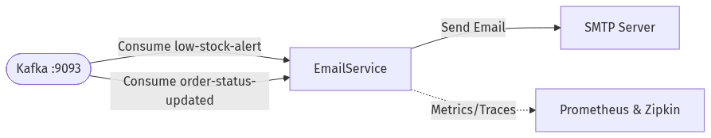

<div align="center">
  <h1>🔔 Bitlord's Computer Parts - Notification Service</h1>
  <p>The centralized messaging hub for dispatching alerts and emails to customers and administrators.</p>
</div>

## 📖 Overview
The **Notification Service** acts as an event sink within the microservices ecosystem. It constantly listens to Apache Kafka for specific domain events (like order updates or inventory alerts) and translates them into actionable communications, such as dispatching emails via an SMTP server.

[⬅️ Back to Main Repository](https://github.com/MalingaBandara/Bitlord-Computer-Parts)

### 🔷 System Flow Diagram



---

## 🛠️ Tech Stack
- **Language**: Java 17
- **Framework**: Spring Boot 3.2
- **Messaging**: Apache Kafka Consumer API
- **Email**: Spring Boot Starter Mail (JavaMailSender)
- **Service Discovery**: Netflix Eureka Client
- **Observability**: Prometheus, Micrometer, Zipkin

## 📡 Event-Driven Communication (Kafka)
The Notification Service is completely decoupled and receives all of its operational triggers asynchronously.

**Topics Consumed:**
- `order-status-updated`: Consumed when an order's status changes (e.g., to `CONFIRMED` or `SHIPPED`). Triggers a customer-facing email notification.
- `low-stock-alert`: Consumed when the Inventory Service detects that a product has fallen below its critical stock threshold. Triggers an alert email to the warehouse administration team.

## 🗄️ Database
*(This service is stateless and does not require a dedicated relational database).*

## 🚀 How to Run Locally

### Prerequisites
- JDK 17
- Maven
- Infrastructure dependencies running (Kafka, Zookeeper, Eureka Server) via the main repository's `docker-compose.yml`.
- A configured SMTP Server (e.g., Mailtrap, Gmail App Passwords) for testing.

### Steps
1. Navigate to the `notification-service` directory.
2. Build the project:
   ```bash
   mvn clean install -DskipTests
   ```
3. Update `application.yml` with your SMTP server credentials.
4. Run the application:
   ```bash
   mvn spring-boot:run
   ```
5. The service will start on port `8083` and register itself with the Eureka Server.
